## 5.1.0 / 2018-04-14

### Photo

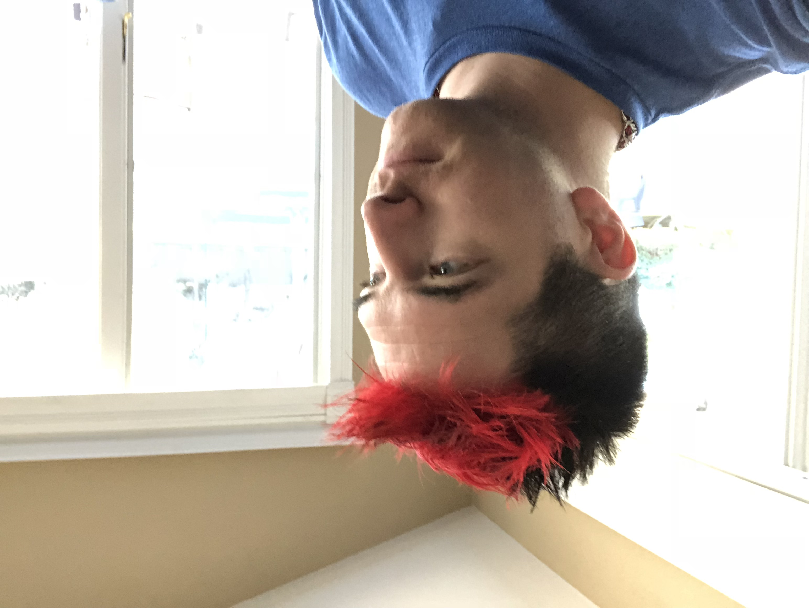

### Experimental

* Dyed rest of the hair black to cover up some of that gray and white
* Only did the front to look like my Sunset Overdrive character

## 5.0.0 / 2014-06-14

### Photo

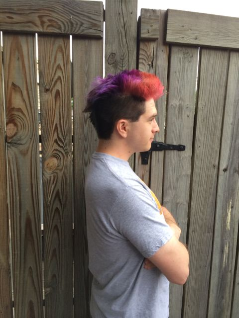

### Bug Fixes

* Went back to [Special Effects](http://www.specialeffectsusa.com/) dyes due
  to issues with Pravanna and Sparks fading to silver within 3 weeks.

### Experimental

* [Bi Pride Flag!](http://en.wikipedia.org/wiki/Bisexual_pride_flag) Three colors against short black hair!

## 4.2.1 / 2014-05-05

### Photo

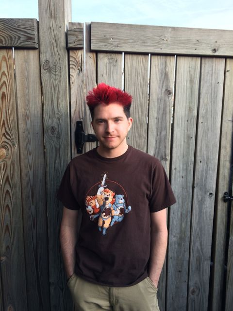

### Experimental

* Did not bleach this time around to let the roots show more of the red

## 4.2.0 / 2014-03-17

### Photo

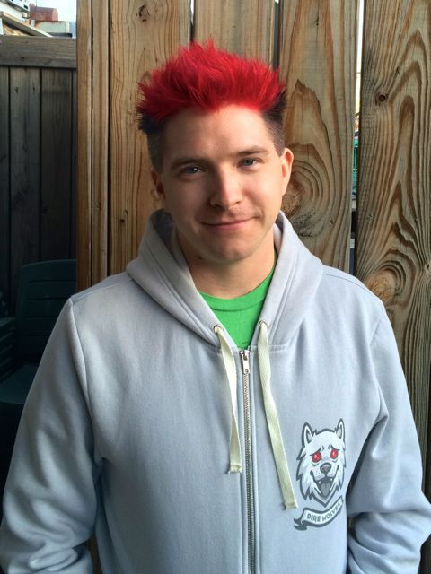

### Experimental

* New style with red and black border to show off the red color more
* Trying Sparks Brand Red Hair Dye

## 4.1.1 / 2014-02-11

### Photo

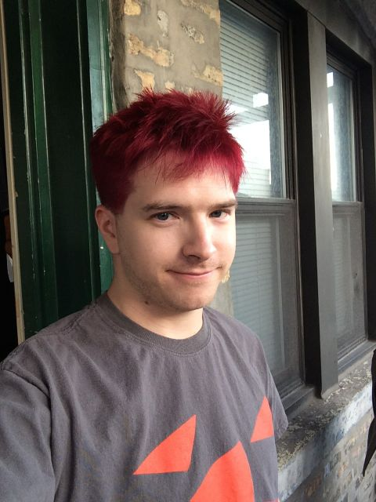

### Bug Fixes

* Re-applied the Pravanna Chroma-Silk Vivids Red dye

## 4.1.0 / 2014-02-01

### Photo

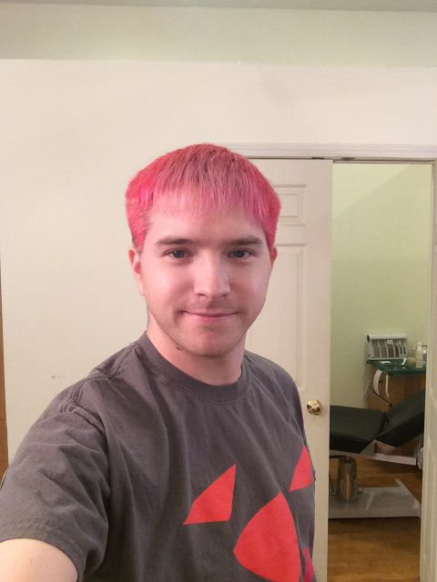

### Bug Fixes

* Changing back to Red did not take very well

## 4.0.0-beta / 2013-12-22

### Photo

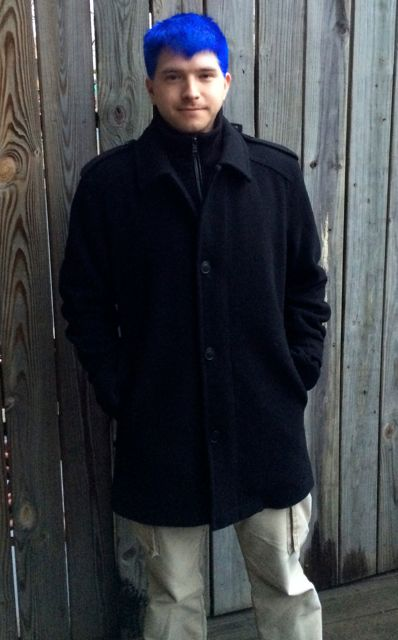

### Experimental

* Beta testing Pravanna Chroma-Silk Vivids Blue dye.

## 3.5.0 / 2013-11-08

### Photo

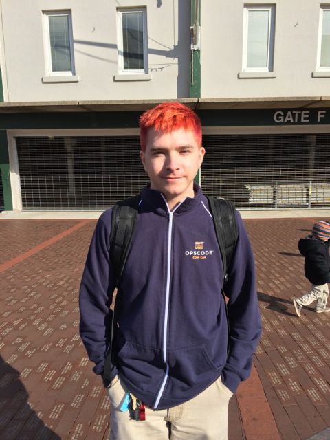

### Enhancements

* Winterized by growing out the Mohawk

## 3.0.0 / 2013-09-29

### Photo

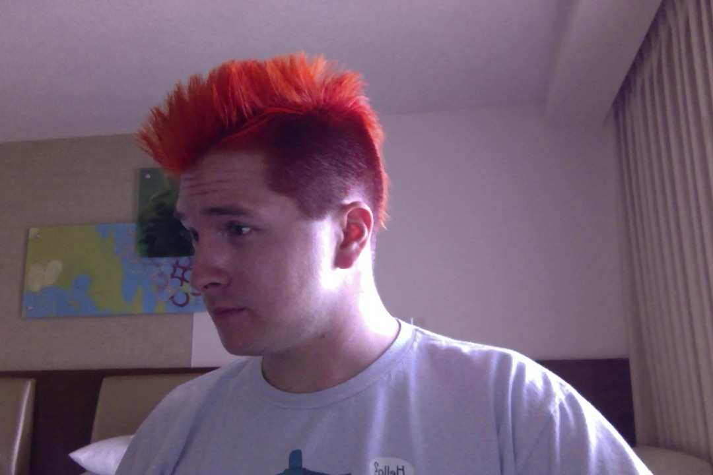

### Enhancements

* Dyed sides of hair deep red for more contrast
* Blended Orange and Red for a brighter mohawk

### Bug Fixes

* Shortened mohawk length again to prevent hair from covering eyes

## 2.5.0 / 2013-08-17

### Photo

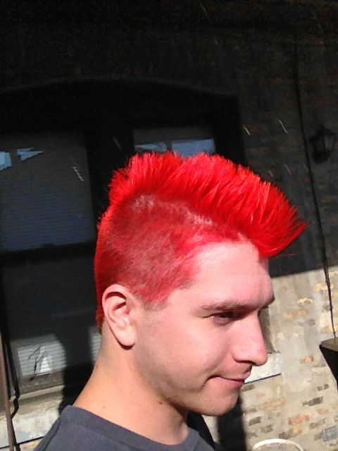

### Enhancements

* Shaved down sides of head
* Narrowed haircut for a more defined mohawk

### Bug Fixes

* Shortened hair. When it's too long it required more hair gel to maintain.

## 2.0.0 / 2013-08-03

### Photo

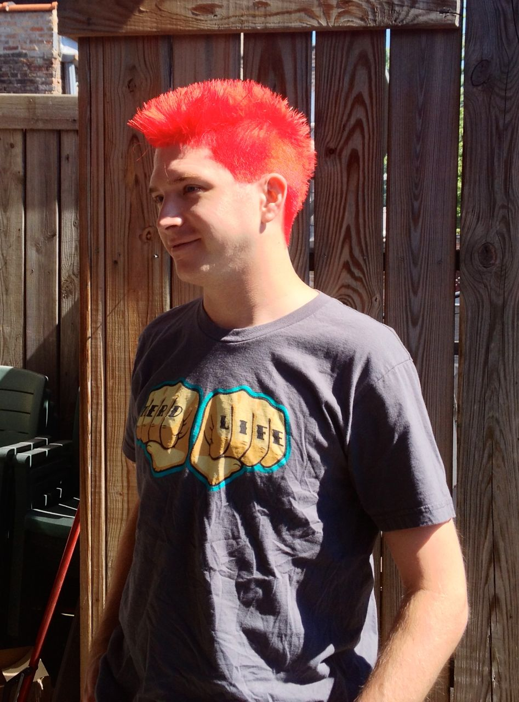

### Enhancements

* New semi-mohawk look! Can wear this up as a faux-hawk or down as a flat top
* Still red on the sides, but quickly growing out to show a nice contrast

## 1.5.0 / 2013-06-07

### Photo

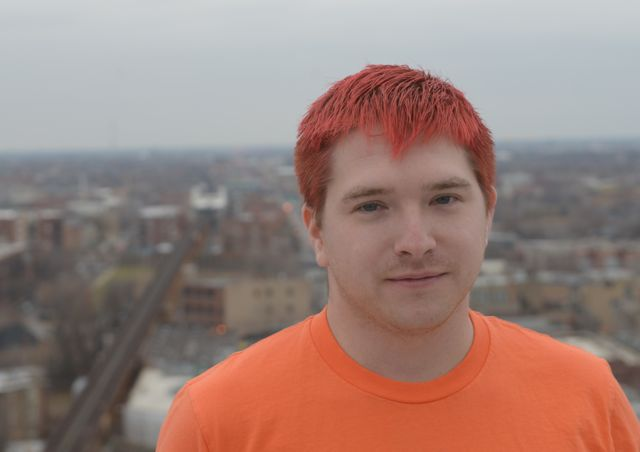

### Enhancements

* Much brighter color! Had to bleach to acehieve a higher color tone

### Deprecations

* Darker red hair dye underneath was discontinued by the manufacturer, hence
  the bleaching.

## 1.0.0 / 2011-04-09

### Photo

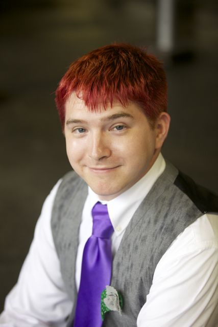

### Enhancements

* Figured out a double-dye technique. Deep red under, bright red on top.
* Now using [Special Effects](http://www.specialeffectsusa.com/)

### Bug Fixes

* Discontinued bleaching to prevent possible lightening and fading of the color.
  Previously, the red stain used would wash out easily.

## 1.0.Beta / 2011-04-02

### Photo

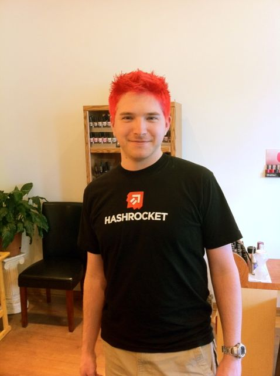

### Release Notes

* Initial release
* Bleached hair for a bright red color!
